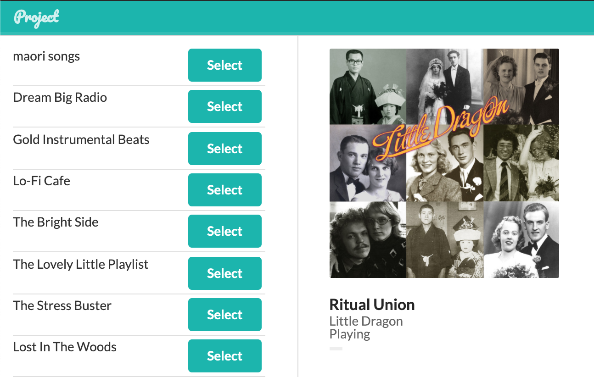

# Project

A work in progress.

Working with React, TypeScript, Websockets and the Spotify API.

### Run:

```
npm install
npm start
```

Open: `http://localhost:3000/`

Requires `SPOTIFY_CLIENT_ID=` in `.env`


